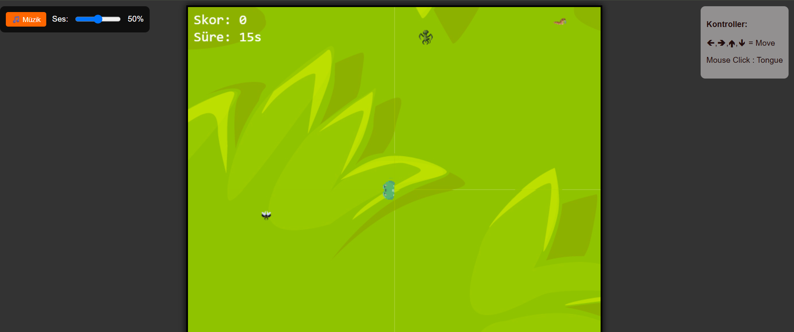
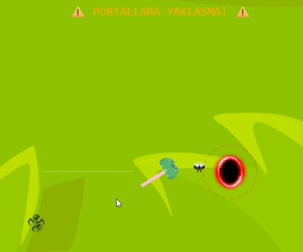

# JSoyun
js,canva,html tabanlı oyun projesi

https://elifyadairem.github.io/JSoyun/

Oynanış videosu-https://www.youtube.com/watch?v=9hLIarz4w9M

## Temel Oyun Görüntüsü

🎮 Oyun Hakkında
Kurbağa Avı, oyuncuların yeşil bir kurbağa kontrolü altında çeşitli böcekleri yakalayarak puan topladığı survival tarzı bir oyundur. Ancak dikkat! Haritada yanan portallar var ve bunlara girmeye çalışırsanız kurbağan yanar!

✨ Özellikler

Gerçek Zamanlı Aksiyon: Smooth hareket sistemi ve dinamik kamera
Çeşitli Böcek Türleri:

🪰 Sinek (5 puan)
🐝 Arı (10 puan)
🐲 Ejder Böceği (20 puan)

Tehlikeli Portallar: Ateşli portallar seni yakabilir!
Progressif Zorluk: Zaman geçtikçe daha fazla portal ve böcek
Müzik ve Ses Efektleri: Atmosferik arka plan müziği ve kurbağa sesleri
Görsel Efektler: Yanma animasyonları ve portal efektleri
Responsive Kontroller: Klavye ve mouse desteği

## Portal ve Tongue Mekaniği

Kontroller

🡸 🢂 🢁 🡻 (Ok Tuşları): Kurbağayı hareket ettir
Mouse Click: Fare imlecinin olduğu yöne dil uzat ve böcek yakala
🎵 Müzik Butonu: Arka plan müziğini aç/kapat
Ses Kontrolü: Müzik seviyesini ayarla

Oyun Kuralları

Böcekleri yakalayarak puan topla
Portallardan uzak dur! - Yaklaşırsan yanmaya başlarsın
Tek hakkın var - dikkatli ol!

🚀 Kurulum ve Çalıştırma
Gereksinimler

Modern web tarayıcısı (Chrome, Firefox, Safari, Edge)
HTML5 Canvas desteği
Ses dosyaları için audio desteği

Hızlı Başlangıç
  Repository'yi klonlayın
  Gerekli dosyaları kontrol edin
Oyunu başlatın
    index.html dosyasını çift tıklayarak tarayıcıda açın

Bilinen Sorunlar ve Gelecek Planları

  Mevcut Sorunlar
    -Bazı tarayıcılarda ses dosyaları otomatik başlamayabilir
    -Çok yüksek skorlarda performans düşüşü olabilir
    -Yanma ve Retry ekranı düzgün çalışamamaktadır
    -Portal ve Böcek sayıları düzgün spawnlanmamaktadır

Gelecek Güncellemeler(Yapılmak istenenler)

  - Tasarlanılan oyun mekaniğinde kurbağanın belirli skor seviyelerinde hareket karmaşıklığı yaratıp 
   puan toplamasını zorlaştırmak (skor 50 olduğunda oyuncu sağa gitmek isterse kurbaga sola hareket etsin vb.)
   - Farklı kurbağa karakterleri
    -Daha fazla böcek türü

  TEŞEKKÜRLER

  
    Assetler için   -https://patchworkpx.itch.io/lil-froggy
                    -https://jeevo.itch.io/insect-enemies
  
  Ses ve Müzik için   - https://www.chosic.com/download-audio/39324/
                      - https://pixabay.com/sound-effects/frog-croaking-sound-effect-322956/

  

